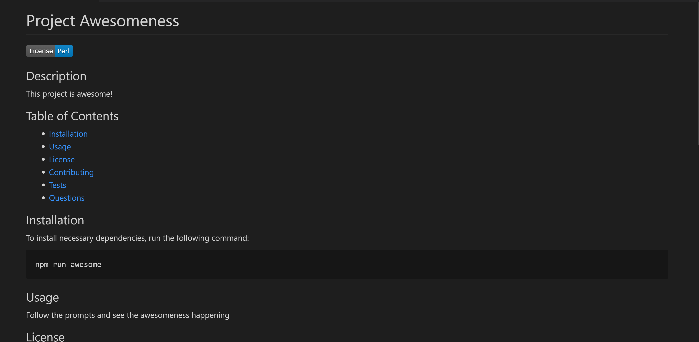

# README-Generator

This CLI application was built to generate a quality README for open source projects hosted on GitHub. A series of prompts asks the user for information about the project's title, description, installation, usage, license, ways of contributing, tests, and how to contact the author for questions or comments about the project. After the user's input, a README is generated with all the sections described above. The file also displays a table of contents with links to the respective sections and a badge with the project license at the top of the page.

Click the image below for a video demo of the application.

 
